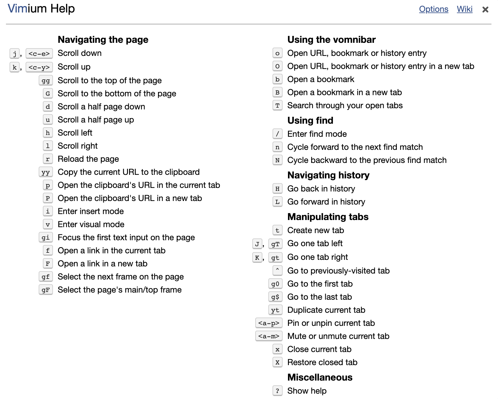

# Chrome 神级插件-[Vimium](https://github.com/philc/vimium)

> Vimium 是 Chrome 浏览器的效率插件，它继承了 Vim 中的常用操作，让你在使用 Chrome 浏览器过程中，无论是浏览网页、切换标签或是其它任何操作，都可以通过键盘快速完成！


## 页面导航

```bash
?                   # 显示 help，查询 Vimium 的使用方法
j                   # 当前页面向下移动
k                   # 当前页面向上移动
h                   # 向左移动
l                   # 向右移动
zH                  # 一直移动到左部
zL                  # 一直移动到右部
gg                  # 跳转到页面的顶部
G                   # 跳转到页面的底部
d                   # 向下翻页（相当于 PageDown）
u                   # 向上翻页（相当于 PageUp）
r                   # 重新载入该页（相当于 F5 刷新页面）
gi                  # 将焦点集中到第一个输入框（输入 gNi 则焦点集中到第 N 个输入框）
gf                  # 循环到当前页面的下一个框层
gF                  # 选择页面的主/顶框
gs                  # 查看页面源代码
gu                  # 跳转到 URL 页面路径的父级（xxx.com/xxx/ --> xxx.com/）
gU                  # 转到 URL 层次结构的根目录(也就是 xxx.com)
ge                  # 编辑当前 URL
gE                  # 编辑当前URL并在新选项卡中打开
yy                  # 拷贝当前页面的 URL 到剪贴板
yf                  # 拷贝某一个 URL 到剪贴板
i                   # 输入模式（按 Esc 回到命令模式）
v                   # 进入预览模式，使用 p / P 粘贴，然后使用 y 来拷贝
f                   # 显示当前页面上所有可点击链接，再输入相应字母在当前标签页打开
F                   # 显示当前页面上所有可点击的链接，再输入相应字母在新标签页打开
b                   # 在当前页打开一个书签（输入部分网址会自动搜索）
B                   # 在新的标签页打开一个书签
p                   # 在当前标签中打开剪贴板的 URL	
P                   # 在新标签页中打开剪贴板的 URL
<Alt+f>             # 在当前页面打开多个链接
<Ctrl+e>            # 当前页面向下移动
<Ctrl+y>            # 当前页面向上移动
```

**注：Vimium 的大杀器 f 键要加以使用，即 f + 页面浮动字符 可以打开页面上的任何链接，大量减少鼠标操作！**


## 查找模式

```bash
/                   # 当前页面查找
n                   # 向下查找匹配内容
N                   # 向上查找匹配内容
```


## 导航历史

```bash
H                   # 回退上一个历史页面（相当于浏览器中的向左箭头）
L                   # 回到下一个历史页面（相当于浏览器的向右箭头）
```


## 标记（锚点）

```bash
ma                  # 设置当前页标记 a ，只能在当前tab页面跳转，m + 小写字母
mA                  # 设置全局标记 A ，可以切换到其他tab的跳转过来，m + 大写字母
`a                  # 跳转到本地标记 a
`A                  # 跳转到 q 全局标记 a
``                  # 跳回到跳转之前的位置 (即在执行 gg，G，n，N，或/ a 之前的位置）
```


## 标签页操作

```bash
t                   # 创建一个新的标签页
x                   # 关闭当前的标签页(相当于 ⌘+w)
X                   # 恢复刚刚关闭的标签页(相当于 ⌘+⇧+w)
W                   # 将当前标签移动到新窗口
^                   # 切换到 上一个历史标签页（可用于两个标签页之间切换）
g0                  # 切换到第一个标签（数字 0，不是字母 O）
g$                  # 切换到最后一个标签（我习惯用 ⌘+9）
yt                  # 复制当前标签页并打开
<<                  # 将当前标签页向左移动
>>                  # 将当前标签页向左移动
K，gt               # 跳转到右边的一个标签页
J，gT               # 跳转到左边的一个标签页
<Alt+p>             # 固定标签栏
```


## 使用搜索框

```bash
o                   # 从 URL、书签、历史记录中搜索地址，回车打开
O                   # 从 URL、书签、历史记录中搜索地址，回车在新标签页中打开
b                   # 仅从书签搜索地址，回车打开
B                   # 仅从书签搜索地址，回车新标签页中打开
T                   # 搜索当前浏览器已打开的所有标签
```


## 自定义搜索引擎

配置自定义搜索引擎，通过快捷键 o/O 调起搜索框，输入搜索引擎简写，再输入空格，再输入搜索词回车，则会调用对应的搜索引擎进行搜索。

> 搜索引擎简写 搜索引擎地址 搜索引擎名字

例如：以下为个人自定义搜索引擎！

```bash
g: https://www.google.com/search?q=%s Google
G: https://www.google.com/search?q=%s Google
zh: https://www.zhihu.com/search?type=content&q=%s 知乎
ZH: https://www.zhihu.com/search?type=content&q=%s 知乎
tb https://s.taobao.com/search?q=%s 淘宝
TB https://s.taobao.com/search?q=%s 淘宝
jd https://search.jd.com/Search?keyword=%s 京东
JD https://search.jd.com/Search?keyword=%s 京东
bd: https://www.baidu.com/s?wd=%s 百度
BD: https://www.baidu.com/s?wd=%s 百度
bz https://search.bilibili.com/all?keyword=%s b站
BZ https://search.bilibili.com/all?keyword=%s b站
aqy https://so.iqiyi.com/so/q_%s 爱奇艺
AQY https://so.iqiyi.com/so/q_%s 爱奇艺
tm https://list.tmall.com/search_product.htm?q=%s 天猫
TM https://list.tmall.com/search_product.htm?q=%s 天猫
db https://www.douban.com/search?q=%s 豆瓣
DB https://www.douban.com/search?q=%s 豆瓣
y: https://www.youtube.com/results?search_query=%s Youtube
Y: https://www.youtube.com/results?search_query=%s Youtube
```


## 预览模式

与 Vim 可视模式类似！

```bash
先用 / 定位，找到想要选择的字符
再按 v ,进入模式
然后使用:
j                   # 向下一行
k                   # 向上一行
h                   # 向左一个字符或标点（数字 +h，可以移动多个字符）
l                   # 向右一个字符或标点（数字 +l，可以移动多个字符）
w                   # 下一个标点符号后位置，包括看不见的换行符
e                   # 下一个标点符号前位置
b                   # 取消选中上一个字符，字符和标点算一个字符
```


## 其他

```bash
5t                   # 数字 num + t，打开 num 个 tab 页面
<Esc>                # Esc 按钮，可以从任意控制命令、任意模式中退出（例如插入模式、查找模式）
```


## 帮助信息

```bash
？                   # 显示命令的帮助提示（再按一次关闭）
Shift+/              # 显示命令的帮助提示
```


## 快捷键对照表




## 网络资源

- [vimium.github.io](https://vimium.github.io/)
- [Vimium 成神之路-键盘党的胜利](https://zhuanlan.zhihu.com/p/64533566)
- [15分钟入门 Chrome神器 Vimium](https://www.jianshu.com/p/849d6b21e02e)
- [神器 Vimium：比同级程序员成长更快](https://zhuanlan.zhihu.com/p/38179086)


---
